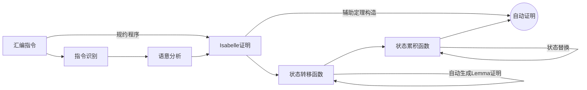
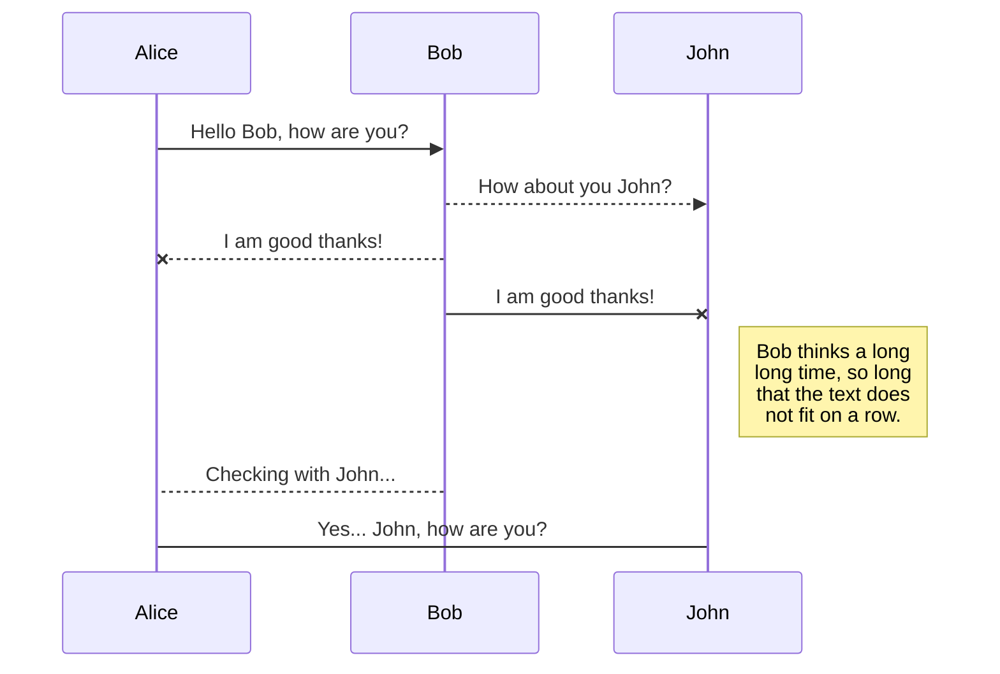
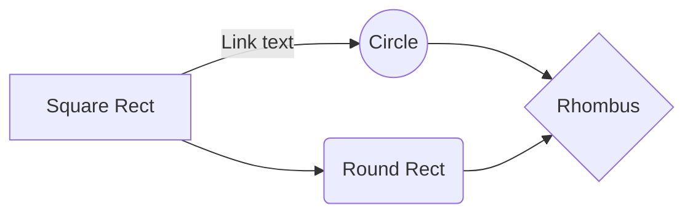

# 汇编语言的自动证明

## 进度估计
实现了汇编指令识别

- 指令的名称、指令后缀
- 参数识别（寄存器，立即数，变址寻址）
- 指令表的构造，用来寻找对应指令的操作函数
- 对相应的指令调用isabella生成函数

证明部分
- 对应汇编指令的
	- 状态转移函数
	- 状态累积函数生成
	- 寄存器值替换后的一个lemma证明


## 系统设计
### 设计目标
- 实现arm汇编的自动证明

### 程序结构



 -  汇编语言规约程序
	 + 构建一个汇编的模型
	 + 识别汇编指令，将汇编指令的语义抽取出来
	 + 将汇编指令转换为对应的isabella代码里的状态转换函数

--------
## 详细设计说明

### 指令识别
将整个汇编文件按行分割识别

- option	配置，以 . 开头，设置了一些全局的环境
- label 标号，以.开头，汇编代码里会被使用，需要识别出来并存储记录
- instruction 指令识别


标号识别，将标号与配置区分开来，标号需要存储起来，用来标记代码位置，从C语言得到的arm汇编语言是没有行号的，需要记录行号或者代码块，标号会关联行号，带有标号的代码可能是指令跳转之后的入口，所以寄存器的状态不是顺序生成的，带标号也有可能是定义数据块的情况，这两种情况都需要做出区分

指令识别将汇编指令划分为两个部分，操作指令，指令参数
操作指令名包含三个参数信息，指令名，执行条件，指令后缀
构建一个指令表（inst_table) ，用来存储一些指令操作的信息，根据指令名再去调用相应的处理信息

指令参数分为0，1，2，3个参数，分别对每一个参数可能的情况进行识别，用单独的结构param来表示

指令表的调用函数inst_fn
- 根据指令的执行条件读取标识位
- 根据不同指令的语意，读取参数param的信息，记录寄存器更改的信息（语意分析）
- 根据指令后缀是否修改标识位

语意分析，汇编模型的状态改变，并调用对应的函数（A）生成isabella代码的状态转移函数，调用生成函数（B）生成状态转移的证明，自动分配一个状态累积函数
> A和B的函数需要对每一条指令都单独设计
>> 状态转移函数，isabella中一个state到另一个state的转变函数。
辅助状态转移证明，用来规约原来的state和转移函数生成的状态之间的关系，这个lemma是可以自动证明通过的，用来说明生成的转移函数是正确的
>> 状态累积函数，用来累积状态的变化，用来证明一些整体的性质

辅助lemma证明单独的状态转移的正确性比较简单，可以直接在规约程序中用C语言去生成

状态累积函数的设计问题：
- 状态需要初始化工作
- 状态内部分量替换，难点分析
	- ？形式化描述怎么描述
	- ？按照执行过程来进行替换，有点像写了一个arm指令模拟执行的解释器
	- ？带有循环或者分支的代码，中间会有非常复杂的判断
	- ？汇编代码太长的时候，累积状态的描述也会非常复杂，会影响自动证明
	- ? 这个替换的过程，可以在C中做，也可以在isabella中做，但是都不太好实现，需要对之前的信息做记录
-------
考虑一个顺序的C语言程序
``` c++
int main()
{
	int a,b,sum,sub;
	a = 1;
	b = 2;
	sum = a + b;
	sub = a - b;
	return (sum * sub);
}
```
转换成的汇编为
``` c
	.arch armv5t
	.eabi_attribute 20, 1
	.eabi_attribute 21, 1
	.eabi_attribute 23, 3
	.eabi_attribute 24, 1
	.eabi_attribute 25, 1
	.eabi_attribute 26, 2
	.eabi_attribute 30, 6
	.eabi_attribute 34, 0
	.eabi_attribute 18, 4
	.file "test.c"
.text
	.align 2
	.global main
	.syntax unified
	.arm
	.fpu softvfp
	.type main, %function
main:
	@ args = 0, pretend = 0, frame = 16
	@ frame_needed = 1, uses_anonymous_args = 0
	@ link register save eliminated.
	str fp, [sp, #-4]!
	add fp, sp, #0
	sub sp, sp, #20
	mov r3, #1
	str r3, [fp, #-20]
	mov r3, #2
	str r3, [fp, #-16]
	ldr r2, [fp, #-20]
	ldr r3, [fp, #-16]
	add r3, r2, r3
	str r3, [fp, #-12]
	ldr r2, [fp, #-20]
	ldr r3, [fp, #-16]
	sub r3, r2, r3
	str r3, [fp, #-8]
	ldr r3, [fp, #-12]
	ldr r2, [fp, #-8]
	mul r1, r2, r3
	mov r3, r1
	mov r0, r3
	add sp, fp, #0
	@ sp needed
	ldr fp, [sp], #4
	bx lr
	.size main, .-main
	.ident "GCC: (Ubuntu/Linaro 7.5.0-3ubuntu1~18.04) 7.5.0"
	.section .note.GNU-stack,"",%progbits

```
这一段汇编里包含了 `add sub mul mov str ldr bx` 几条指令，寄存器用到了rx通用寄存器，fp，sp栈寄存器，寻址方式包括了寄存器寻址和偏移寻址，这一段汇编比较直接，不详细解释每一行都意义了。

以第一行代码 `str fp, [sp, #-4]!` 为例，首先识别函数parse可以将这一句分解为，str， fp, [sp, #-4]! 三个部分，str只含有一个指令str，没有条件和后缀部分，参数识别为 2 参数指令，第一个是寄存器参数，fp，第二个是寄存器偏移寻址参数，根据str的操作语意，函数gen_str_state_trans生成一个isabella函数，这个函数接受一个state参数，并将state参数里，sp - 4 的值设置成fp，gen_str_lemma是一个证明，证明这个函数对state的改变只有sp - 4 的值是原来的fp值。
其他行代码同理，目前没有全部完成

[未做] F函数累积状态，替换每一个state的表示到初始的state寄存器和内存表示


-----
### 暂时不考虑
 - 自动证明
	 + 系统的形式化描述
	 + 构建辅助定理
- 形式化规约证明（暂时不考虑）
	+ 系统的属性描述
	+ 汇编的高级语意表示
	+ 属性描述与汇编高级语意的对应证明（程序正确性证明）


# Welcome to StackEdit!

Hi! I'm your first Markdown file in **StackEdit**. If you want to learn about StackEdit, you can read me. If you want to play with Markdown, you can edit me. Once you have finished with me, you can create new files by opening the **file explorer** on the left corner of the navigation bar.


# Files

StackEdit stores your files in your browser, which means all your files are automatically saved locally and are accessible **offline!**

## Create files and folders

The file explorer is accessible using the button in left corner of the navigation bar. You can create a new file by clicking the **New file** button in the file explorer. You can also create folders by clicking the **New folder** button.

## Switch to another file

All your files and folders are presented as a tree in the file explorer. You can switch from one to another by clicking a file in the tree.

## Rename a file

You can rename the current file by clicking the file name in the navigation bar or by clicking the **Rename** button in the file explorer.

## Delete a file

You can delete the current file by clicking the **Remove** button in the file explorer. The file will be moved into the **Trash** folder and automatically deleted after 7 days of inactivity.

## Export a file

You can export the current file by clicking **Export to disk** in the menu. You can choose to export the file as plain Markdown, as HTML using a Handlebars template or as a PDF.


# Synchronization

Synchronization is one of the biggest features of StackEdit. It enables you to synchronize any file in your workspace with other files stored in your **Google Drive**, your **Dropbox** and your **GitHub** accounts. This allows you to keep writing on other devices, collaborate with people you share the file with, integrate easily into your workflow... The synchronization mechanism takes place every minute in the background, downloading, merging, and uploading file modifications.

There are two types of synchronization and they can complement each other:

- The workspace synchronization will sync all your files, folders and settings automatically. This will allow you to fetch your workspace on any other device.
	> To start syncing your workspace, just sign in with Google in the menu.

- The file synchronization will keep one file of the workspace synced with one or multiple files in **Google Drive**, **Dropbox** or **GitHub**.
	> Before starting to sync files, you must link an account in the **Synchronize** sub-menu.

## Open a file

You can open a file from **Google Drive**, **Dropbox** or **GitHub** by opening the **Synchronize** sub-menu and clicking **Open from**. Once opened in the workspace, any modification in the file will be automatically synced.

## Save a file

You can save any file of the workspace to **Google Drive**, **Dropbox** or **GitHub** by opening the **Synchronize** sub-menu and clicking **Save on**. Even if a file in the workspace is already synced, you can save it to another location. StackEdit can sync one file with multiple locations and accounts.

## Synchronize a file

Once your file is linked to a synchronized location, StackEdit will periodically synchronize it by downloading/uploading any modification. A merge will be performed if necessary and conflicts will be resolved.

If you just have modified your file and you want to force syncing, click the **Synchronize now** button in the navigation bar.

> **Note:** The **Synchronize now** button is disabled if you have no file to synchronize.

## Manage file synchronization

Since one file can be synced with multiple locations, you can list and manage synchronized locations by clicking **File synchronization** in the **Synchronize** sub-menu. This allows you to list and remove synchronized locations that are linked to your file.


# Publication

Publishing in StackEdit makes it simple for you to publish online your files. Once you're happy with a file, you can publish it to different hosting platforms like **Blogger**, **Dropbox**, **Gist**, **GitHub**, **Google Drive**, **WordPress** and **Zendesk**. With [Handlebars templates](http://handlebarsjs.com/), you have full control over what you export.

> Before starting to publish, you must link an account in the **Publish** sub-menu.

## Publish a File

You can publish your file by opening the **Publish** sub-menu and by clicking **Publish to**. For some locations, you can choose between the following formats:

- Markdown: publish the Markdown text on a website that can interpret it (**GitHub** for instance),
- HTML: publish the file converted to HTML via a Handlebars template (on a blog for example).

## Update a publication

After publishing, StackEdit keeps your file linked to that publication which makes it easy for you to re-publish it. Once you have modified your file and you want to update your publication, click on the **Publish now** button in the navigation bar.

> **Note:** The **Publish now** button is disabled if your file has not been published yet.

## Manage file publication

Since one file can be published to multiple locations, you can list and manage publish locations by clicking **File publication** in the **Publish** sub-menu. This allows you to list and remove publication locations that are linked to your file.


# Markdown extensions

StackEdit extends the standard Markdown syntax by adding extra **Markdown extensions**, providing you with some nice features.

> **ProTip:** You can disable any **Markdown extension** in the **File properties** dialog.


## SmartyPants

SmartyPants converts ASCII punctuation characters into "smart" typographic punctuation HTML entities. For example:

|                |ASCII                          |HTML                         |
|----------------|-------------------------------|-----------------------------|
|Single backticks|`'Isn't this fun?'`            |'Isn't this fun?'            |
|Quotes          |`"Isn't this fun?"`            |"Isn't this fun?"            |
|Dashes          |`-- is en-dash, --- is em-dash`|-- is en-dash, --- is em-dash|


## KaTeX

You can render LaTeX mathematical expressions using [KaTeX](https://khan.github.io/KaTeX/):

The *Gamma function* satisfying $\Gamma(n) = (n-1)!\quad\forall n\in\mathbb N$ is via the Euler integral

$$
\Gamma(z) = \int_0^\infty t^{z-1}e^{-t}dt\,.
$$

> You can find more information about **LaTeX** mathematical expressions [here](http://meta.math.stackexchange.com/questions/5020/mathjax-basic-tutorial-and-quick-reference).


## UML diagrams

You can render UML diagrams using [Mermaid](https://mermaidjs.github.io/). For example, this will produce a sequence diagram:



And this will produce a flow chart:


